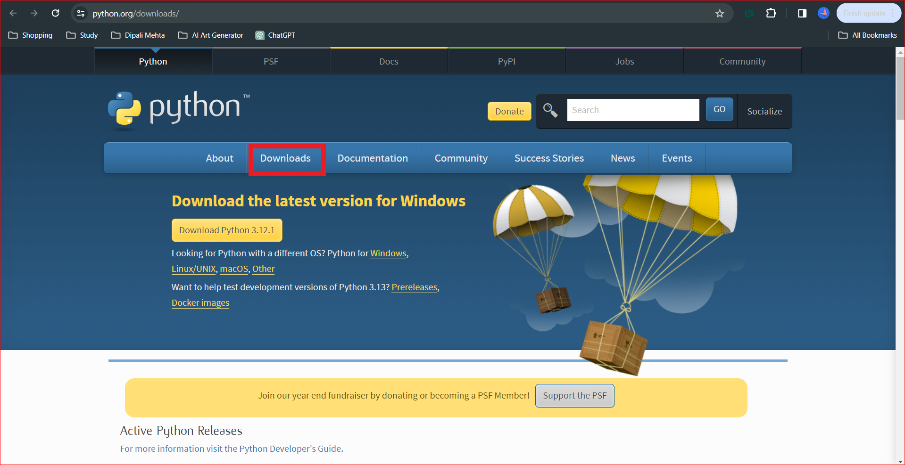

# Installing Python on Windows

## 1. Using the Python Installer:

1. **Visit the Python Website:**
   - Go to the official Python website: [Python Downloads](https://www.python.org/downloads/).
   

2. **Download Python:**
   - Click on the "Downloads" tab.
   - Choose the version of Python you want and click on the "Download Python X.X.X" button.

3. **Run the Installer:**
   - Once the installer is downloaded (e.g., `python-3.X.X.exe`), double-click on it.
   - Check the box that says "Add Python X.X to PATH" during installation (this is important for easy command line access).

4. **Install Python:**
   - Click "Install Now" to start the installation process.
   - The installer will copy the necessary files and set up Python on your system.

5. **Verify Installation:**
   - Open a command prompt and type `python --version` to verify that Python has been installed.

# 2. Using Chocolatey Package Manager:

1. **Install Chocolatey (if not installed):**
   - Open a PowerShell command prompt as an administrator.
   - Run the following command to install Chocolatey:
     ```powershell
     Set-ExecutionPolicy Bypass -Scope Process -Force; [System.Net.ServicePointManager]::SecurityProtocol = [System.Net.ServicePointManager]::SecurityProtocol -bor 3072; iex ((New-Object System.Net.WebClient).DownloadString('https://chocolatey.org/install.ps1'))
     ```

2. **Install Python using Chocolatey:**
   - Run the following command in the PowerShell command prompt:
     ```powershell
     choco install python
     ```

3. **Verify Installation:**
   - Open a new command prompt and type `python --version` to verify the installation.

# 3. Using Anaconda Distribution:

1. **Download Anaconda:**
   - Go to the Anaconda website: [Anaconda Distribution](https://www.anaconda.com/products/distribution).
   - Download the Anaconda installer for Windows.

2. **Run the Installer:**
   - Double-click on the downloaded installer (e.g., `Anaconda3-X.X.X-Windows-x86_64.exe`).
   - Follow the installation prompts.

3. **Choose Installation Options:**
   - During installation, you can choose whether to add Anaconda to the system PATH variable.

4. **Verify Installation:**
   - Open a command prompt and type `python --version` to verify that Anaconda has been installed.


# 4. Using the Microsoft Store:

1. **Open Microsoft Store:**
   - Open the Microsoft Store application on your Windows system.

2. **Search for Python:**
   - In the search bar of the Microsoft Store, type "Python" and press Enter.

3. **Choose Python Version:**
   - Look for an official Python distribution by the Python Software Foundation.
   - Click on the version you want to install (e.g., Python 3.X).

4. **Install Python:**
   - Click the "Get" or "Install" button to download and install Python from the Microsoft Store.

5. **Launch Python:**
   - Once installed, you can launch Python from the Start menu.

6. **Verify Installation:**
   - Open a command prompt and type `python --version` to verify that Python has been installed.

# 5. Using Scoop:

1. **Install Scoop:**
   - Open a PowerShell command prompt as an administrator.
   - Run the following command to install Scoop:
     ```powershell
     Set-ExecutionPolicy RemoteSigned -scope CurrentUser
     iwr -useb get.scoop.sh | iex
     ```

2. **Install Python using Scoop:**
   - Run the following command to install Python:
     ```powershell
     scoop install python
     ```

3. **Verify Installation:**
   - Open a new command prompt and type `python --version` to verify that Python has been installed.

# 6. Using WinPython:

1. **Download WinPython:**
   - Visit the WinPython website: [WinPython](https://winpython.github.io/).
   - Navigate to the "Stable" or "Quantum" section (depending on your preference for the Python version).
   - Download the WinPython installer (e.g., `WinPython X.X.X.XQtX.exe`).

2. **Run the Installer:**
   - Double-click on the downloaded installer to run it.
   - Follow the installation prompts.

3. **Choose Installation Options:**
   - During installation, you can choose options such as the Python version, architecture, and additional packages to include.

4. **Launch WinPython:**
   - Once installed, you can launch WinPython from the Start menu.

5. **Verify Installation:**
   - Open a command prompt and type `python --version` to verify that WinPython has been installed.

# 7. Using Miniconda:

1. **Download Miniconda:**
   - Visit the Miniconda website: [Miniconda](https://docs.conda.io/en/latest/miniconda.html).
   - Download the Miniconda installer for Windows (choose the 64-bit or 32-bit version based on your system architecture).

2. **Run the Installer:**
   - Double-click on the downloaded installer (e.g., `Miniconda3-latest-Windows-x86_64.exe`) to run it.
   - Follow the installation prompts.

3. **Choose Installation Options:**
   - During installation, you can choose whether to add Miniconda to the system PATH variable.

4. **Launch Miniconda Prompt:**
   - Once installed, open the "Miniconda Prompt" from the Start menu. This is a command prompt with Conda activated.

5. **Create a Conda Environment (Optional):**
   - You can create a new Python environment using the following command:
     ```bash
     conda create --name myenv python=3.8
     ```
     Replace "myenv" with the desired environment name.

6. **Activate the Conda Environment:**
   - Activate the environment using:
     ```bash
     conda activate myenv
     ```

7. **Verify Installation:**
   - In the activated environment, you can type `python --version` to verify that Python has been installed.

# 8. Using PyOxidizer:

1. **Install PyOxidizer:**
   - Visit the PyOxidizer documentation: [PyOxidizer](https://pyoxidizer.readthedocs.io/).
   - Follow the installation instructions for your platform. Typically, it involves downloading a binary or building from source.

2. **Create a Configuration File:**
   - Create a `pyoxidizer.toml` configuration file. Example configuration:
     ```toml
     [package]
     name = "my_python_app"
     version = "0.1.0"
     ```

3. **Build the Executable:**
   - Open a command prompt in the directory containing the `pyoxidizer.toml` file.
   - Run the following command to build the standalone executable:
     ```bash
     pyoxidizer build
     ```

Run the Executable:Once the build process is complete, you'll find the standalone executable in the ./target/release/ directory.
Run the executable to start your Python application.
